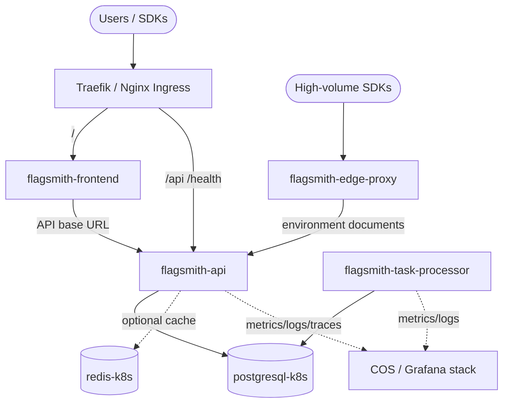

# Flagsmith Operators

[](https://github.com/Flagsmith/flagsmith-operator/actions/workflows/ci.yaml)
[](LICENSE)

A family of [Juju](https://juju.is) charmed operators for
[Flagsmith](https://flagsmith.com) — the open-source feature flag, remote
config and A/B testing platform — designed to run on Kubernetes.

These charms encapsulate operational best practice for running Flagsmith in
production: not just installation, but the **day-2** operations that keep it
healthy — schema migrations, credential rotation, scaling, backups,
observability, and graceful integration with the data and ingress layers of a
Juju model.

## Architecture

Flagsmith is a multi-process application. Rather than cram every process into a
single monolithic charm, this repository follows the Juju ethos of **small,
composable operators** that are wired together with relations. Each charm owns
exactly one workload and can be scaled, upgraded and observed independently.



| Charm | Workload | Role | Scales |
| --- | --- | --- | --- |
| [`flagsmith-api`](charms/flagsmith-api) | Django + Gunicorn | REST API, admin, unified dashboard, **owns DB schema** | horizontally |
| [`flagsmith-task-processor`](charms/flagsmith-task-processor) | `run-task-processor` worker | async tasks: webhooks, audit, scheduled flag changes, analytics | horizontally |
| [`flagsmith-frontend`](charms/flagsmith-frontend) | Node/React SPA | dedicated dashboard frontend (optional; API serves one too) | horizontally |
| [`flagsmith-edge-proxy`](charms/flagsmith-edge-proxy) | Go/Python edge proxy | low-latency read-only flag evaluation cache for SDKs | horizontally |

### Why Kubernetes charms?

Flagsmith is distributed and operated as OCI images by upstream. A sidecar
(Kubernetes) charm lets us run the official images unmodified under
[Pebble](https://documentation.ubuntu.com/pebble/), reuse the rich Kubernetes
data/observability charm ecosystem (`postgresql-k8s`, `redis-k8s`,
`traefik-k8s`, COS Lite) over relations, and map each Flagsmith process to its
own independently-scalable operator. A machine charm would have to reinvent
process supervision and dependency installation for no benefit.

## Quick start

```bash
# A Kubernetes cloud registered with Juju (e.g. via `concierge` or microk8s).
juju add-model flagsmith

# Deploy the whole platform from the bundle.
juju deploy ./bundle/bundle.yaml --trust

# ...or deploy piecemeal:
juju deploy postgresql-k8s --channel 14/stable --trust
juju deploy ./charms/flagsmith-api/flagsmith-api_*.charm \
    --resource flagsmith-image=flagsmith/flagsmith:v2.197.0
juju integrate flagsmith-api postgresql-k8s
```

See each charm's `README.md` and the [`docs/`](docs) directory for full
deployment, configuration and day-2 operations guides.

## Repository layout

```
flagsmith-operator/
├── charms/                 # one directory per charmed operator
│   ├── flagsmith-api/
│   ├── flagsmith-task-processor/
│   ├── flagsmith-frontend/
│   └── flagsmith-edge-proxy/
├── bundle/                 # juju bundle wiring the charms + dependencies
├── docs/                   # Diátaxis documentation
├── .github/workflows/      # lint, unit and integration CI
├── CONTRIBUTING.md
├── SECURITY.md
├── CODE_OF_CONDUCT.md
└── LICENSE
```

## Developing

Each charm is a self-contained [charmcraft](https://canonical.com/charmcraft)
project. From within a charm directory:

```bash
tox -e lint      # ruff + codespell + pyright
tox -e unit      # ops-scenario unit tests
charmcraft pack  # build the .charm
tox -e integration  # jubilant integration tests (needs a Juju k8s controller)
```

The repository ships a top-level [`justfile`](justfile) with recipes that fan
these commands out across all charms.

## License

Apache-2.0. See [LICENSE](LICENSE). Flagsmith itself is a trademark of Bullet
Train Ltd; these operators are an independent packaging effort.
